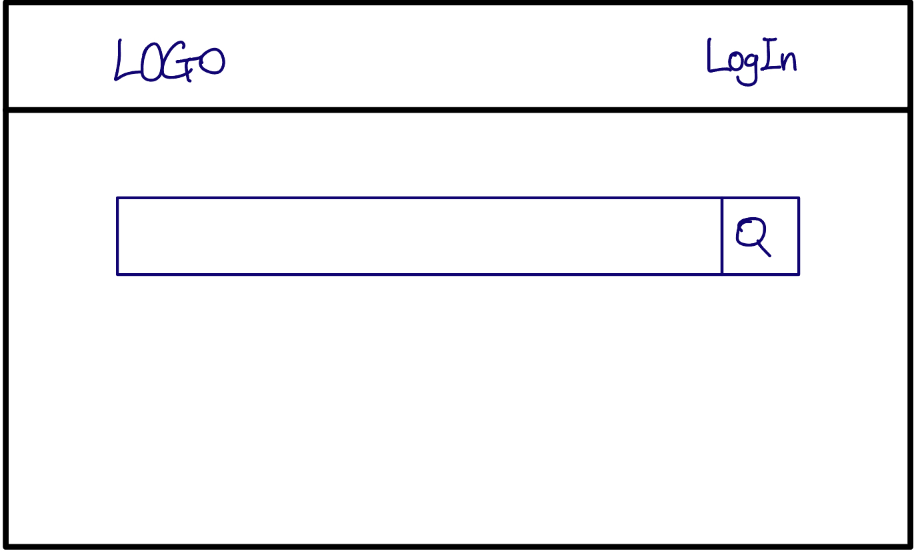
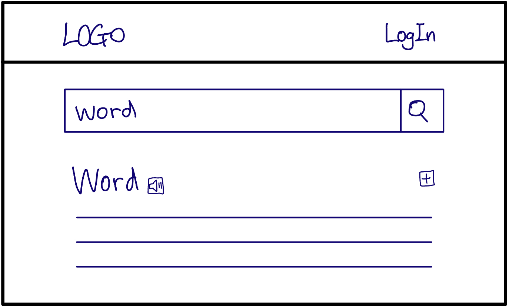
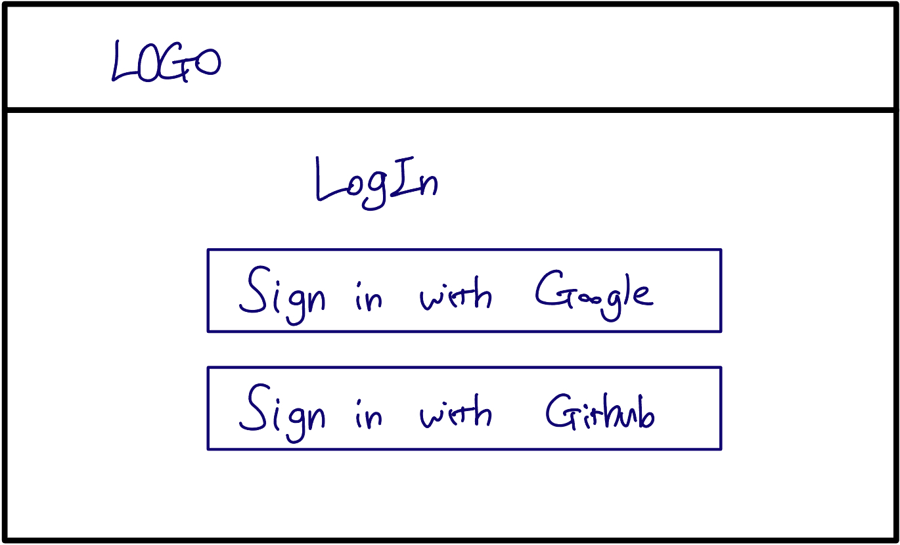
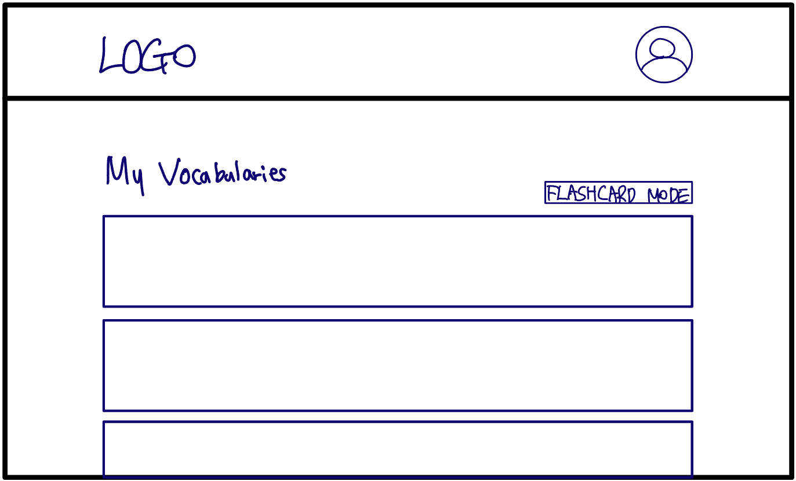
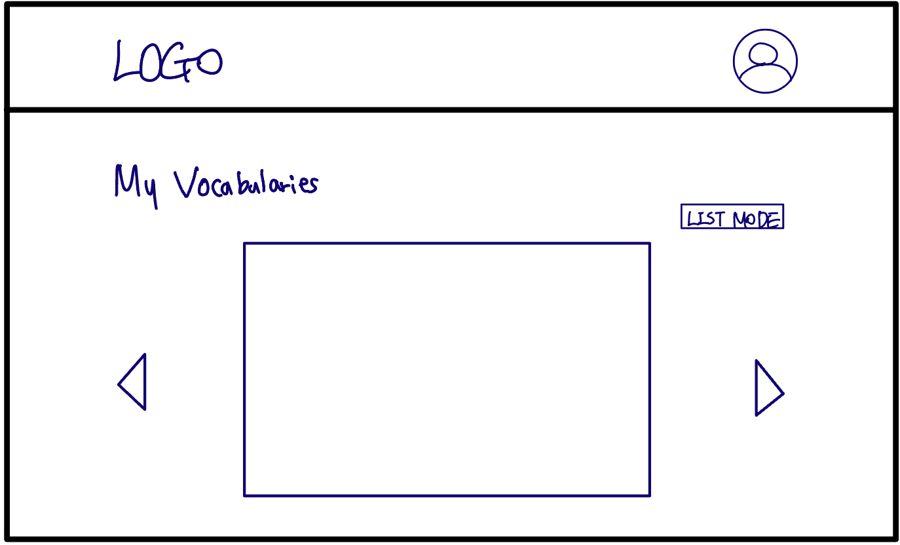

# AllThatWord_Dictionary APP

## Description

A Dictionary App with flashcard function using [Free Dictionary API](https://dictionaryapi.dev/)

## Table of Contents

- [Installation](#Installation)
- [Design](#Design)
- [Usage](#Usage)
- [Troubleshooting](#Troubleshooting)

---

## Installation

TBD

## Design

### Technologies

- React
- TypeScript
- Tailwind
- ESLint, Prettier
- react-router-dom
- Framer-motion - TBD
- Firebase Authentication - TBD
- Firebase Realtime Database - TBD

### Colors

- #5BBA6F - #3FA34D - #2A9134 - #137547 - #054A29 [Color palette](https://coolors.co/palette/5bba6f-3fa34d-2a9134-137547-054a29)

### fonts

- Head font: [Roboto](https://fonts.google.com/specimen/Roboto?query=roboto)
- Body font: [Exo](https://fonts.google.com/specimen/Exo?query=exo)

### Layout

| Page            | Desktop Layout                          | Function                                 |
| --------------- | --------------------------------------- | -------------------------------------- |
| Main            |             | - LogIn button: move to login page   - Search button: move to search page with results            |
| Search          |           | - Speaker button: listen to pronunciation   - Save button: save word to user's vocabularies          |
| Login           |            | - Sign in with Google button   - Sign in with Github button           |
| Admin_list      |       | - Flashcard mode button: switch view mode to flashcard mode    |
| Admin_flashcard |  | - List mode button: switch view mode to list mode   - User can flip flashcard to check the definition of the word  |

### Prioritization
#### Must have
- Users can use search function by word.
- Users can listen to the pronunciation of the word.
- Users can move to another page when they click antonyms or synonyms.

#### Should have
- Users can login using google or github.
- Users can save words to their vocabularies.
- Users can see their vocabularies on both list mode and flashcard mode.

#### Nice to have
- Users can use dark mode.

---

## Usage

### Responsive Design

TBD

---

## Troubleshooting

TBD
